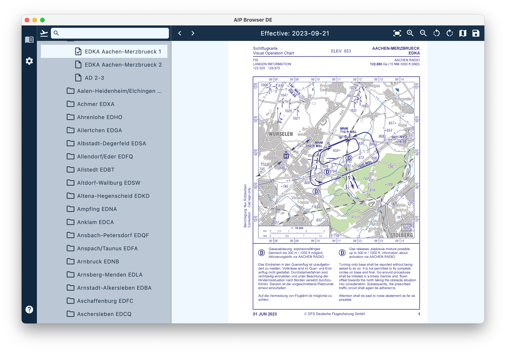

# AIPBrowserDE

## Übersicht

Der *AIP Browser DE* ist ein spezieller Browser für die frei verfügbare Online-Version der AIP VFR von Deutschland. Er bietet mehr Bedienungskomfort und Funktionalität als die entsprechende Webseite. Weitere Informationen zur Installation und Funktion finden sich im [Handbuch](https://mpmediasoft.de/products/AIPBrowserDE/help/AIPBrowserDE.html).

## Fehlermeldungen, Anregungen und Diskussionen zum *AIPBrowserDE*

Rückmeldungen zum AIP Browser DE können zentral über diese Webseite erfolgen. Für Fehlermeldungen und Anregungen gibt es die Rubrik "Issues" und für Fragen und Diskussionen gibt es die Rubrik "Discussions". Um sich aktiv zu beteiligen, muss man sich einmalig, kostenlos bei GitHub registrieren. Diese kleine Mühe erleichtert jedoch die Arbeit am *AIPBrowserDE* enorm. Nur lesen geht auch ohne Registrierung.

